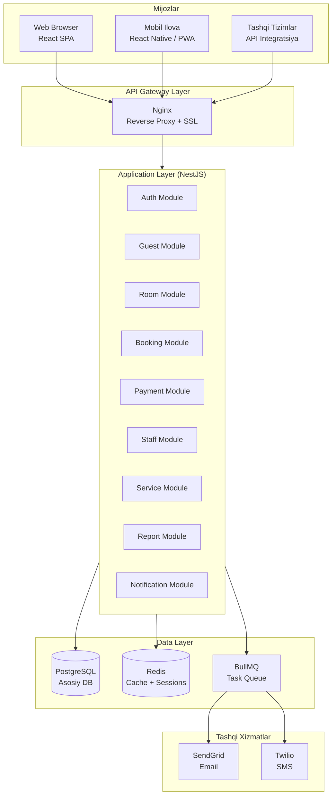
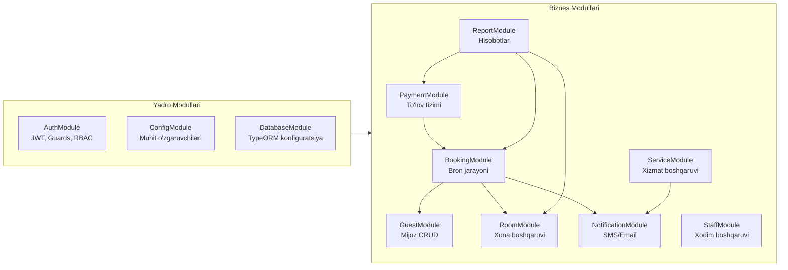
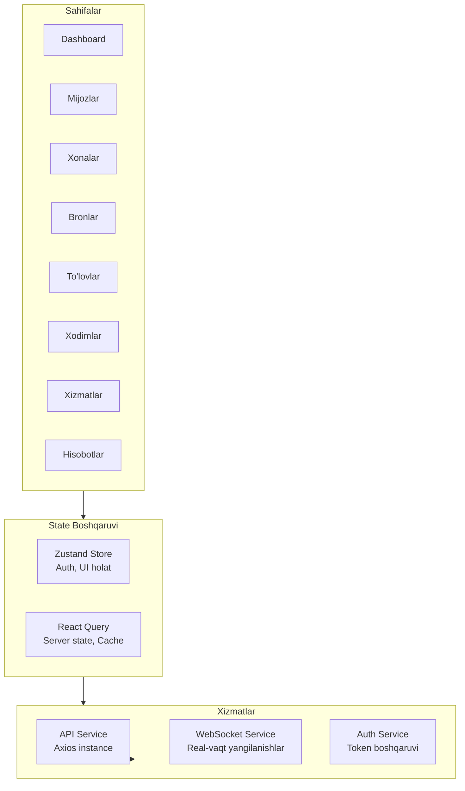
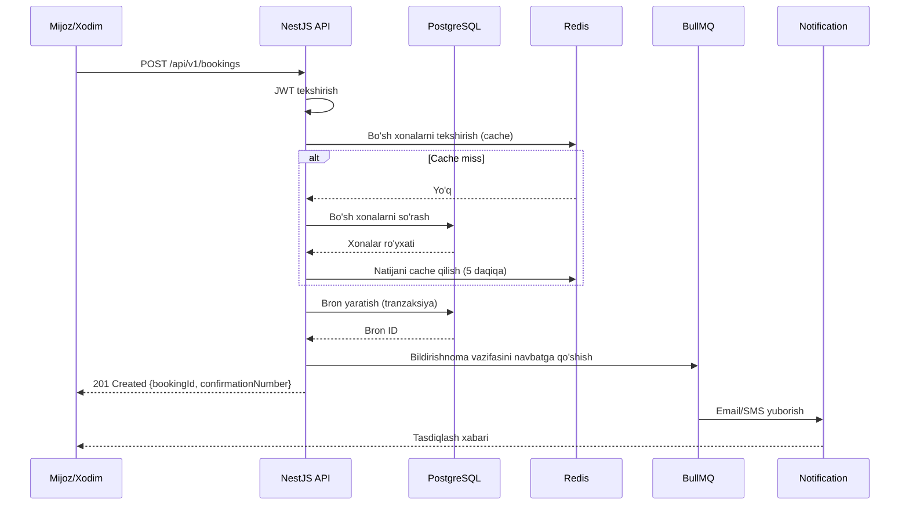
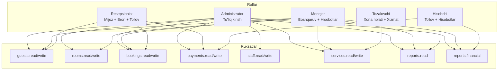
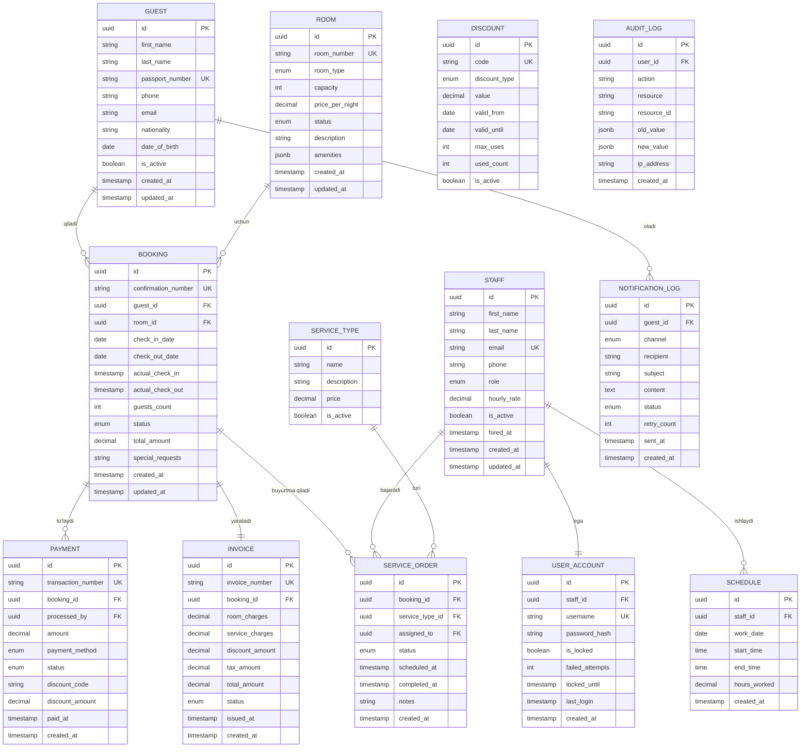

# Texnik Dizayn Hujjati: Mehmonxona Boshqaruv Tizimi

## Mundarija

1. [Umumiy Ko'rinish](#1-umumiy-korinish)
2. [Arxitektura](#2-arxitektura)
3. [Komponentlar va Interfeyslar](#3-komponentlar-va-interfeyslar)
4. [Ma'lumotlar Modellari](#4-malumotlar-modellari)
5. [To'g'rilik Xossalari](#5-togrilik-xossalari)
6. [Xatolarni Boshqarish](#6-xatolarni-boshqarish)
7. [Test Strategiyasi](#7-test-strategiyasi)

---

## 1. Umumiy Ko'rinish

### 1.1 Maqsad

Mehmonxona Boshqaruv Tizimi (Hotel Management System — HMS) — mehmonxona operatsiyalarini to'liq raqamlashtiruvchi va avtomatlashtiradigan web ilovasi. Tizim quyidagi asosiy vazifalarni bajaradi:

- Mijozlarni ro'yxatga olish va bron qilishni boshqarish
- Check-in / Check-out jarayonlarini avtomatlashtirish
- Xonalar holati va narxlarini real vaqtda boshqarish
- To'lovlarni qayta ishlash va hisob-fakturalar yaratish
- Xodimlar va xizmatlarni boshqarish
- Hisobotlar va tahlillar yaratish
- RESTful API orqali tashqi tizimlar bilan integratsiya
- SMS va email bildirishnomalar yuborish

### 1.2 Texnologiya Steki

**Backend:**
- **Runtime:** Node.js 20 LTS
- **Framework:** NestJS (TypeScript) — modulli arxitektura, dependency injection, OpenAPI qo'llab-quvvatlashi
- **ORM:** TypeORM — ma'lumotlar bazasi migratsiyalari va entity boshqaruvi
- **Ma'lumotlar bazasi:** PostgreSQL 16 — asosiy relatsion ma'lumotlar bazasi
- **Cache:** Redis 7 — sessiyalar, real-vaqt holat, rate limiting
- **Xabar navbati:** BullMQ (Redis asosida) — bildirishnomalar va asinxron vazifalar

**Frontend:**
- **Framework:** React 18 + TypeScript
- **State boshqaruvi:** Zustand + React Query (TanStack Query)
- **UI komponent kutubxonasi:** Ant Design 5
- **Grafik va diagrammalar:** Recharts
- **HTTP klient:** Axios

**Infratuzilma:**
- **Konteynerizatsiya:** Docker + Docker Compose
- **Reverse proxy:** Nginx
- **Autentifikatsiya:** JWT (access token 15 daqiqa, refresh token 7 kun)
- **Email:** Nodemailer + SMTP (SendGrid)
- **SMS:** Twilio API
- **Fayl eksport:** PDFKit (PDF), ExcelJS (Excel)
- **API hujjatlari:** Swagger/OpenAPI 3.0

### 1.3 Asosiy Dizayn Qarorlari

| Qaror | Tanlov | Sabab |
|-------|--------|-------|
| Arxitektura | Modulli monolit | Kichik-o'rta hajmli mehmonxona uchun optimal; microservicega o'tish imkoni saqlanadi |
| Ma'lumotlar bazasi | PostgreSQL | ACID tranzaksiyalar, murakkab so'rovlar, JSON qo'llab-quvvatlashi |
| Real-vaqt yangilanishlar | WebSocket (Socket.io) | Xonalar holati va bildirishnomalar uchun |
| API versiyalash | URL prefixi (/api/v1/) | Oddiy va keng qo'llaniladigan yondashuv |
| Autentifikatsiya | JWT + Refresh Token | Stateless, mobil va web uchun mos |

---

## 2. Arxitektura

### 2.1 Yuqori Darajali Arxitektura



### 2.2 Backend Modul Arxitekturasi

NestJS modulli arxitekturasi asosida har bir biznes domeniga alohida modul ajratilgan:



### 2.3 Frontend Arxitekturasi



### 2.4 Ma'lumotlar Oqimi: Bron Yaratish



---

## 3. Komponentlar va Interfeyslar

### 3.1 API Endpointlari

#### Autentifikatsiya

| Metod | Endpoint | Tavsif | Rol |
|-------|----------|--------|-----|
| POST | /api/v1/auth/login | Tizimga kirish | Hammasi |
| POST | /api/v1/auth/logout | Tizimdan chiqish | Hammasi |
| POST | /api/v1/auth/refresh | Token yangilash | Hammasi |
| POST | /api/v1/auth/change-password | Parol o'zgartirish | Hammasi |

#### Mijozlar (Guests)

| Metod | Endpoint | Tavsif | Rol |
|-------|----------|--------|-----|
| GET | /api/v1/guests | Mijozlar ro'yxati | Admin, Menejer, Resepsionist |
| POST | /api/v1/guests | Yangi mijoz qo'shish | Admin, Resepsionist |
| GET | /api/v1/guests/:id | Mijoz ma'lumotlari | Admin, Menejer, Resepsionist |
| PUT | /api/v1/guests/:id | Mijoz ma'lumotlarini yangilash | Admin, Resepsionist |
| DELETE | /api/v1/guests/:id | Mijozni o'chirish | Admin |

#### Xonalar (Rooms)

| Metod | Endpoint | Tavsif | Rol |
|-------|----------|--------|-----|
| GET | /api/v1/rooms | Xonalar ro'yxati | Hammasi |
| POST | /api/v1/rooms | Yangi xona qo'shish | Admin |
| GET | /api/v1/rooms/:id | Xona ma'lumotlari | Hammasi |
| PUT | /api/v1/rooms/:id | Xona ma'lumotlarini yangilash | Admin, Menejer |
| GET | /api/v1/rooms/available | Bo'sh xonalar | Hammasi |
| PATCH | /api/v1/rooms/:id/status | Xona holatini o'zgartirish | Admin, Menejer, Tozalovchi |

#### Bronlar (Bookings)

| Metod | Endpoint | Tavsif | Rol |
|-------|----------|--------|-----|
| GET | /api/v1/bookings | Bronlar ro'yxati | Admin, Menejer, Resepsionist |
| POST | /api/v1/bookings | Yangi bron yaratish | Admin, Resepsionist, API |
| GET | /api/v1/bookings/:id | Bron ma'lumotlari | Admin, Menejer, Resepsionist |
| PATCH | /api/v1/bookings/:id/cancel | Bronni bekor qilish | Admin, Resepsionist, API |
| POST | /api/v1/bookings/:id/checkin | Check-in | Admin, Resepsionist |
| POST | /api/v1/bookings/:id/checkout | Check-out | Admin, Resepsionist |

#### To'lovlar (Payments)

| Metod | Endpoint | Tavsif | Rol |
|-------|----------|--------|-----|
| GET | /api/v1/payments | To'lovlar ro'yxati | Admin, Menejer, Hisobchi |
| POST | /api/v1/payments | To'lov amalga oshirish | Admin, Resepsionist, Hisobchi |
| GET | /api/v1/payments/:id | To'lov ma'lumotlari | Admin, Menejer, Hisobchi |
| POST | /api/v1/payments/:id/refund | Qaytarish | Admin, Menejer |
| GET | /api/v1/invoices/:id | Hisob-faktura | Admin, Menejer, Hisobchi |

#### Xodimlar (Staff)

| Metod | Endpoint | Tavsif | Rol |
|-------|----------|--------|-----|
| GET | /api/v1/staff | Xodimlar ro'yxati | Admin, Menejer |
| POST | /api/v1/staff | Yangi xodim qo'shish | Admin |
| GET | /api/v1/staff/:id | Xodim ma'lumotlari | Admin, Menejer |
| PUT | /api/v1/staff/:id | Xodim ma'lumotlarini yangilash | Admin |
| DELETE | /api/v1/staff/:id | Xodimni arxivlash | Admin |
| GET | /api/v1/staff/:id/schedule | Ish jadvali | Admin, Menejer, Xodim |
| PUT | /api/v1/staff/:id/schedule | Ish jadvalini yangilash | Admin, Menejer |

#### Xizmatlar (Services)

| Metod | Endpoint | Tavsif | Rol |
|-------|----------|--------|-----|
| GET | /api/v1/services | Xizmatlar katalogi | Hammasi |
| POST | /api/v1/service-orders | Xizmat buyurtma qilish | Admin, Resepsionist, API |
| GET | /api/v1/service-orders | Buyurtmalar ro'yxati | Admin, Menejer, Xodim |
| PATCH | /api/v1/service-orders/:id/complete | Xizmatni bajarildi deb belgilash | Xodim, Menejer |

#### Hisobotlar (Reports)

| Metod | Endpoint | Tavsif | Rol |
|-------|----------|--------|-----|
| GET | /api/v1/reports/revenue | Daromad hisoboti | Admin, Menejer, Hisobchi |
| GET | /api/v1/reports/occupancy | Bandlik hisoboti | Admin, Menejer |
| GET | /api/v1/reports/guests | Mijozlar statistikasi | Admin, Menejer |
| GET | /api/v1/reports/export | Hisobotni eksport qilish | Admin, Menejer, Hisobchi |

### 3.2 Rol Asosida Kirish Nazorati (RBAC)



### 3.3 WebSocket Hodisalari

Real-vaqt yangilanishlar uchun Socket.io ishlatiladi:

| Hodisa | Yo'nalish | Ma'lumot |
|--------|-----------|---------|
| `room:status_changed` | Server → Client | `{roomId, status, timestamp}` |
| `booking:created` | Server → Client | `{bookingId, roomId, guestName}` |
| `booking:checkin` | Server → Client | `{bookingId, roomId}` |
| `booking:checkout` | Server → Client | `{bookingId, roomId}` |
| `service:assigned` | Server → Client | `{orderId, staffId, serviceType}` |
| `service:completed` | Server → Client | `{orderId, completedAt}` |
| `notification:alert` | Server → Client | `{type, message, severity}` |

---

## 4. Ma'lumotlar Modellari

### 4.1 Entity Relationship Diagrammasi



### 4.2 Enum Turlari

```typescript
// Xona turi
enum RoomType {
  STANDARD = 'standard',
  LUX = 'lux',
  VIP = 'vip',
}

// Xona holati
enum RoomStatus {
  AVAILABLE = 'available',      // Bo'sh
  OCCUPIED = 'occupied',        // Band
  CLEANING = 'cleaning',        // Tozalanmoqda
  MAINTENANCE = 'maintenance',  // Ta'mirda
}

// Bron holati
enum BookingStatus {
  PENDING = 'pending',          // Kutilmoqda
  CONFIRMED = 'confirmed',      // Tasdiqlangan
  CHECKED_IN = 'checked_in',   // Kirgan
  CHECKED_OUT = 'checked_out', // Chiqqan
  CANCELLED = 'cancelled',      // Bekor qilingan
  NO_SHOW = 'no_show',         // Kelmagan
}

// To'lov usuli
enum PaymentMethod {
  CASH = 'cash',                // Naqd pul
  CARD = 'card',                // Bank kartasi
  ONLINE = 'online',            // Onlayn
}

// To'lov holati
enum PaymentStatus {
  PENDING = 'pending',
  COMPLETED = 'completed',
  FAILED = 'failed',
  REFUNDED = 'refunded',
}

// Xodim roli
enum StaffRole {
  ADMINISTRATOR = 'administrator',
  MANAGER = 'manager',
  RECEPTIONIST = 'receptionist',
  CLEANER = 'cleaner',
  ACCOUNTANT = 'accountant',
}

// Xizmat buyurtmasi holati
enum ServiceOrderStatus {
  PENDING = 'pending',
  ASSIGNED = 'assigned',
  IN_PROGRESS = 'in_progress',
  COMPLETED = 'completed',
  CANCELLED = 'cancelled',
}

// Bildirishnoma kanali
enum NotificationChannel {
  EMAIL = 'email',
  SMS = 'sms',
}

// Chegirma turi
enum DiscountType {
  PERCENTAGE = 'percentage',    // Foiz
  FIXED = 'fixed',              // Belgilangan summa
}
```

### 4.3 Asosiy DTO (Data Transfer Object) Sxemalari

```typescript
// Bron yaratish
interface CreateBookingDto {
  guestId: string;
  roomId: string;
  checkInDate: string;       // ISO 8601: YYYY-MM-DD
  checkOutDate: string;      // ISO 8601: YYYY-MM-DD
  guestsCount: number;
  specialRequests?: string;
  discountCode?: string;
}

// To'lov amalga oshirish
interface ProcessPaymentDto {
  bookingId: string;
  amount: number;
  paymentMethod: PaymentMethod;
  discountCode?: string;
}

// Xona holati o'zgartirish
interface UpdateRoomStatusDto {
  status: RoomStatus;
  reason?: string;
}

// Hisobot so'rovi
interface ReportQueryDto {
  startDate: string;
  endDate: string;
  format?: 'json' | 'pdf' | 'excel';
  groupBy?: 'day' | 'week' | 'month';
}
```

### 4.4 Indekslar va Ishlash Optimizatsiyasi

```sql
-- Tez-tez ishlatiladigan so'rovlar uchun indekslar
CREATE INDEX idx_bookings_guest_id ON bookings(guest_id);
CREATE INDEX idx_bookings_room_id ON bookings(room_id);
CREATE INDEX idx_bookings_dates ON bookings(check_in_date, check_out_date);
CREATE INDEX idx_bookings_status ON bookings(status);
CREATE INDEX idx_rooms_status ON rooms(status);
CREATE INDEX idx_rooms_type ON rooms(room_type);
CREATE INDEX idx_payments_booking_id ON payments(booking_id);
CREATE INDEX idx_payments_paid_at ON payments(paid_at);
CREATE INDEX idx_service_orders_booking_id ON service_orders(booking_id);
CREATE INDEX idx_service_orders_assigned_to ON service_orders(assigned_to);
CREATE INDEX idx_audit_log_user_id ON audit_log(user_id);
CREATE INDEX idx_audit_log_created_at ON audit_log(created_at);
CREATE INDEX idx_notification_log_guest_id ON notification_log(guest_id);

-- Pasport raqami bo'yicha tez qidiruv
CREATE UNIQUE INDEX idx_guests_passport ON guests(passport_number);

-- Bron raqami bo'yicha tez qidiruv
CREATE UNIQUE INDEX idx_bookings_confirmation ON bookings(confirmation_number);
```

